# SecureTrainer Challenge Implementation & Deliverables Design

## Overview

SecureTrainer is a comprehensive cybersecurity training platform developed as a final year project for a Bachelor's degree in Cyber Security. The platform provides interactive, gamified learning experiences through various cybersecurity challenges including SQL injection, XSS, and command injection, with AI-powered adaptive difficulty and a sophisticated scoring system.

## Technology Stack & Dependencies

### Backend Framework
- **Flask**: Python web framework with modular blueprint architecture
- **MongoDB**: NoSQL database for user data, challenges, and analytics
- **PyMongo**: MongoDB driver for Python integration
- **Flask-Mail**: Email delivery system for QR codes and notifications

### Security & Authentication
- **bcrypt**: Password hashing with salt
- **QR Code Authentication**: Token-based login system
- **Session Management**: Secure session handling with automatic expiration
- **Input Validation**: Comprehensive security measures

### AI/ML Components
- **scikit-learn**: Machine learning models for difficulty prediction
- **joblib**: Model persistence and loading
- **numpy**: Numerical computations (optional with fallback)

### Frontend Technologies
- **Tailwind CSS**: Utility-first CSS framework
- **JavaScript**: Interactive functionality and API integration
- **Chart.js**: Data visualization for analytics

## Architecture

### Database Schema Design

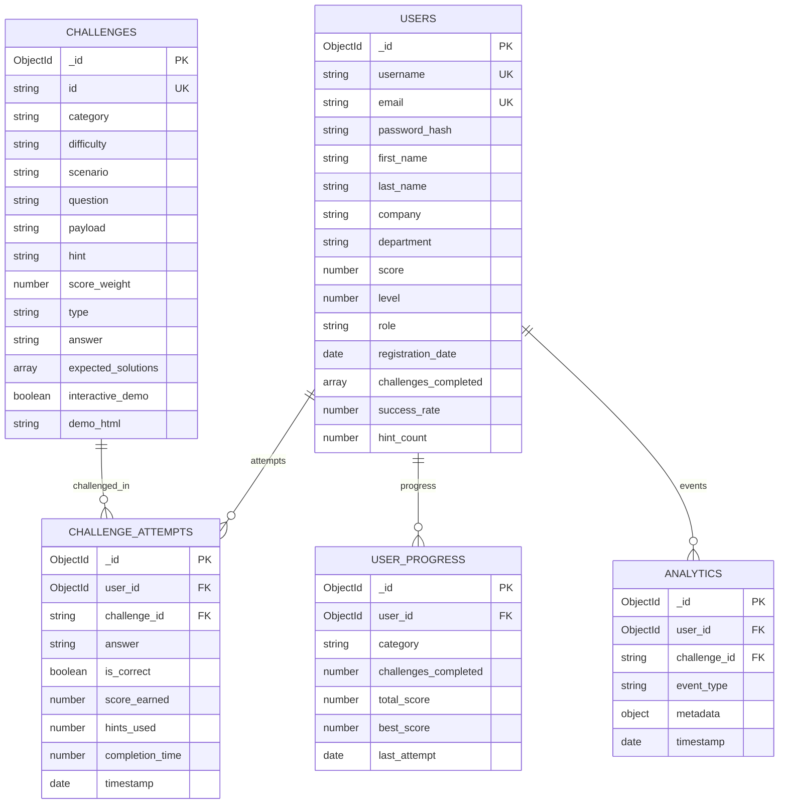

### Application Architecture

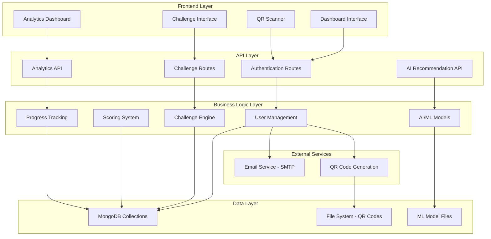

## Challenge System Architecture

### Challenge Categories Implementation

#### 1. SQL Injection Challenges
**Location**: `app/models/challenge_model.py:load_sql_challenges()`

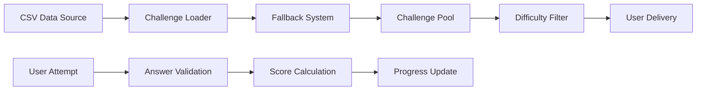

**Challenge Structure**:
- **Beginner**: Authentication bypass (`' OR '1'='1' --`)
- **Intermediate**: Database manipulation (`; DROP TABLE users; --`)
- **Advanced**: Data extraction (`' UNION SELECT username, password FROM users --`)
- **Expert**: Blind SQL injection techniques

#### 2. Cross-Site Scripting (XSS) Challenges
**Location**: `app/models/challenge_model.py:get_xss_challenges()`

**Implementation Details**:
- **Interactive Demos**: Live HTML rendering for payload testing
- **Progressive Difficulty**: Script tags → Event handlers → Filter bypass → DOM-based XSS
- **Real-time Preview**: Users see payload effects immediately

**Challenge Progression**:
1. **Basic Script Injection**: `<script>alert("XSS")</script>`
2. **Event Handler Exploitation**: ``
3. **Filter Bypass**: `<svg onload="alert(1)">`
4. **DOM-based XSS**: innerHTML manipulation
5. **Stored XSS**: Persistent payload storage

#### 3. Command Injection Challenges
**Location**: `app/models/challenge_model.py:get_command_injection_challenges()`

**Scenario Types**:
- **Ping Utilities**: IP address input fields
- **File Operations**: Path traversal vulnerabilities
- **System Commands**: Shell command execution
- **Filter Bypass**: Advanced evasion techniques

### Answer Validation System

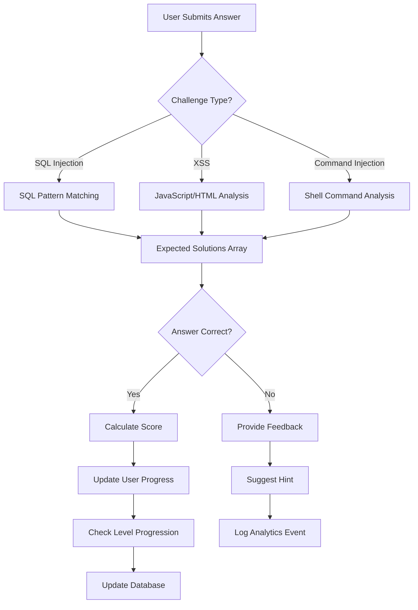

## Scoring & Ranking System

### Score Calculation Algorithm

```python
def calculate_challenge_score(challenge, user_performance):
    base_score = challenge.score_weight * 10
    difficulty_multiplier = {
        'beginner': 1.0,
        'intermediate': 1.5,
        'advanced': 2.0,
        'expert': 3.0
    }
    
    # Apply difficulty multiplier
    score = base_score * difficulty_multiplier[challenge.difficulty]
    
    # Apply hint penalty
    hint_penalty = user_performance.hints_used * 0.1
    score *= (1 - hint_penalty)
    
    # Speed bonus (completion under 5 minutes)
    if user_performance.completion_time < 300:
        score *= 1.2
    
    return round(score)
```

### Level Progression System


### Database Persistence Strategy

#### User Score Updates
**Location**: `app/models/user_model.py:update_user_score_level()`

```python
def update_user_score_level(user_id, score_delta):
    # Atomic score update with level calculation
    db.users.update_one(
        {'_id': user_id},
        {
            '$inc': {'score': score_delta},
            '$set': {
                'level': calculate_new_level(current_score + score_delta),
                'role': determine_role(new_level),
                'last_activity': datetime.now()
            }
        }
    )
```

#### Challenge Attempt Logging
**Location**: Database design includes comprehensive attempt tracking

```python
challenge_attempt = {
    'user_id': ObjectId(user_id),
    'challenge_id': challenge_id,
    'answer': user_answer,
    'is_correct': validation_result,
    'score_earned': calculated_score,
    'hints_used': hint_count,
    'completion_time': time_taken,
    'timestamp': datetime.utcnow()
}
```

## AI-Powered Adaptive Learning

### Machine Learning Model Integration
**Location**: `app/routes/ai_model.py`

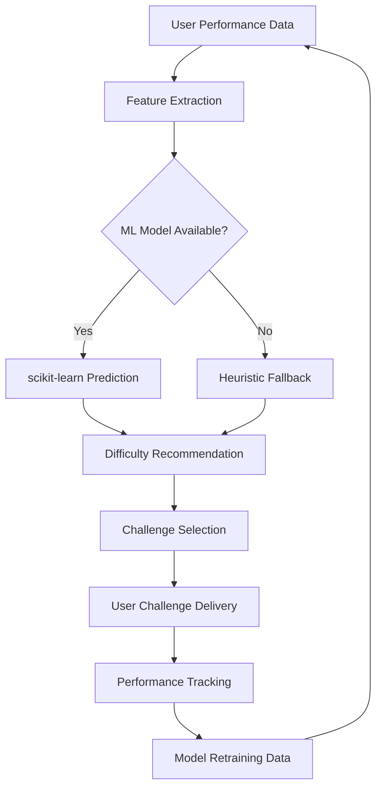

### Feature Engineering for AI Model

```python
def extract_user_features(user):
    features = [
        user.get('level', 1),
        user.get('score', 0),
        user.get('hint_count', 0),
        user.get('challenges_completed', 0),
        user.get('success_rate', 0.5),
        user.get('avg_completion_time', 300),
        user.get('consecutive_successes', 0),
        user.get('sql_injection_score', 0),
        user.get('xss_score', 0),
        user.get('command_injection_score', 0),
        # ... additional category-specific scores
    ]
    return normalize_features(features)
```

### Adaptive Hint System
**Location**: `app/routes/ai_model.py:generate_adaptive_hint()`

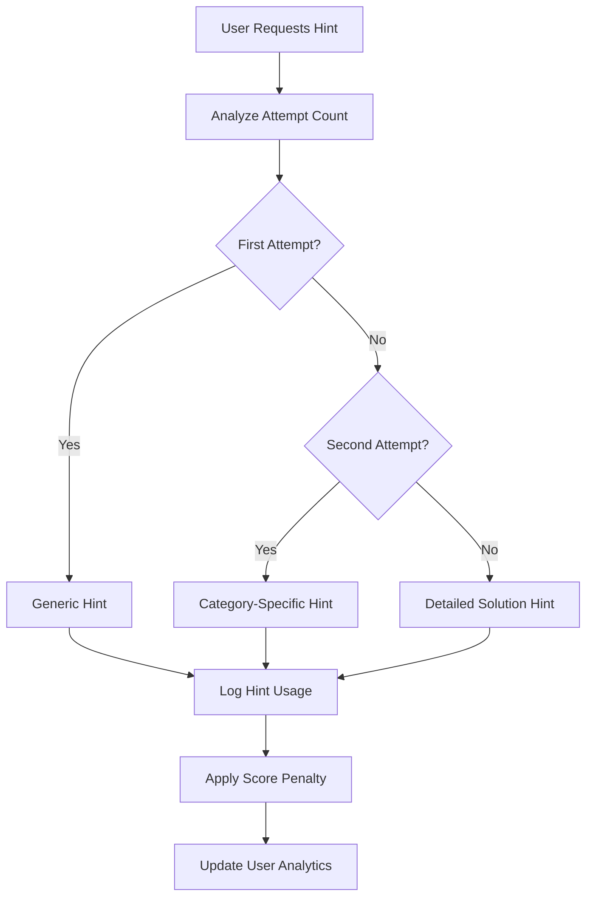

## API Endpoints Reference

### Challenge Management Endpoints

| Endpoint | Method | Purpose | Implementation |
|----------|--------|---------|----------------|
| `/api/challenges/list` | GET | List all challenges | `securetrainer.py:783` |
| `/api/challenges/start` | POST | Start challenge | `securetrainer.py:624` |
| `/api/challenges/submit` | POST | Submit answer | `securetrainer.py:667` |
| `/api/challenges/hint` | POST | Get challenge hint | `securetrainer.py:725` |
| `/api/challenges/category/<category>` | GET | Get by category | `securetrainer.py:823` |
| `/api/challenge/complete/<user_id>` | POST | Complete challenge | `challenge.py:75` |

### User Progress Endpoints

| Endpoint | Method | Purpose | Data Persistence |
|----------|--------|---------|------------------|
| `/api/user/progress` | GET | User statistics | MongoDB users collection |
| `/api/user/rank` | GET | Leaderboard position | Real-time calculation |
| `/api/ai/recommendations` | GET | AI challenge suggestions | ML model integration |

## Interactive Challenge Interface

### Frontend Challenge Components
**Location**: `app/templates/challenges.html`

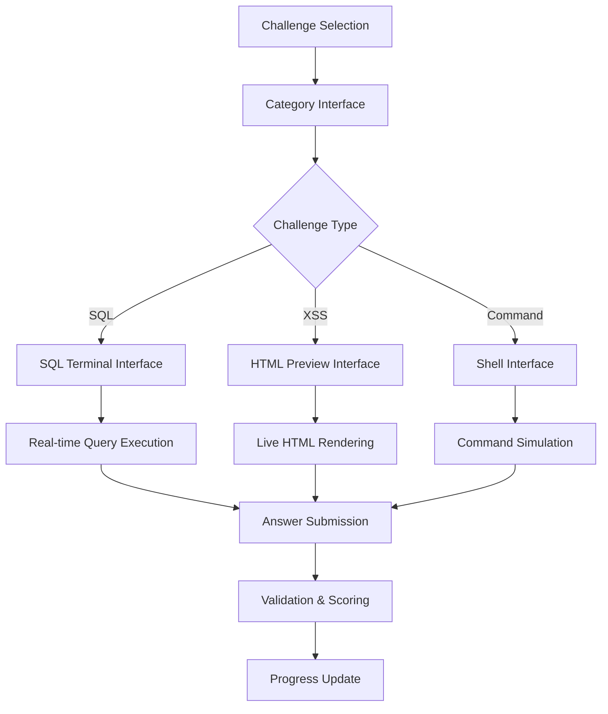

### Interactive Demo Implementation

#### XSS Challenge Demo
```html
<div class="demo-container">
    <h4>Vulnerable Comment System Demo</h4>
    <div class="comment-box">
        <p>User Comment: <span id="comment-display">Loading...</span></p>
    </div>
    <div class="input-section">
        <input type="text" id="comment-input" placeholder="Enter your comment..." />
        <button onclick="displayComment()">Post Comment</button>
    </div>
</div>
<script>
    function displayComment() {
        const input = document.getElementById('comment-input').value;
        document.getElementById('comment-display').innerHTML = input; // Vulnerable!
    }
</script>
```

## Data Flow Architecture

### Challenge Completion Flow

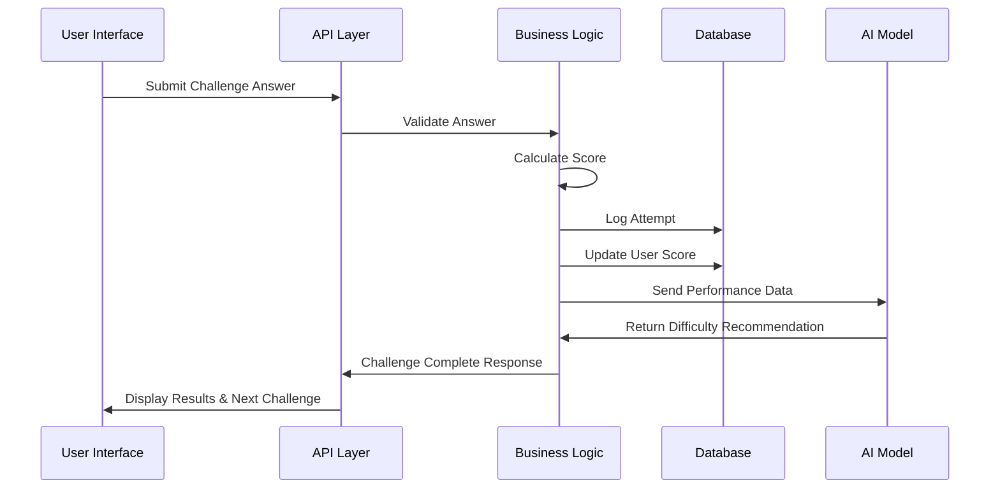

### Analytics Data Collection

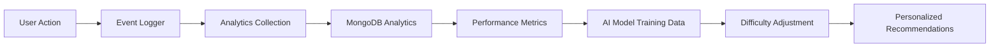

## Testing Strategy

### Unit Testing Approach

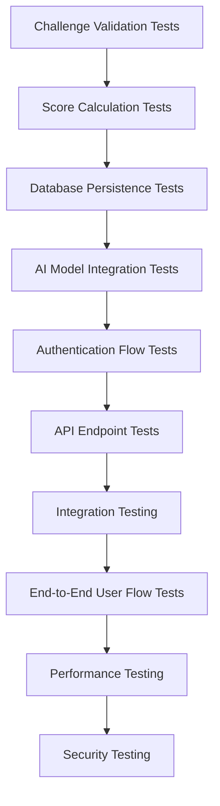

### Test Coverage Areas

#### 1. Challenge System Tests
- Answer validation accuracy
- Score calculation correctness
- Difficulty progression logic
- Hint system functionality

#### 2. Database Persistence Tests
- User score updates
- Challenge attempt logging
- Progress tracking accuracy
- Data consistency checks

#### 3. AI Model Tests
- Feature extraction accuracy
- Prediction consistency
- Fallback system reliability
- Performance improvement validation

#### 4. Security Tests
- Input sanitization
- Authentication bypass attempts
- XSS prevention in challenge content
- SQL injection in user inputs

## Deployment Architecture

### Production Environment Setup

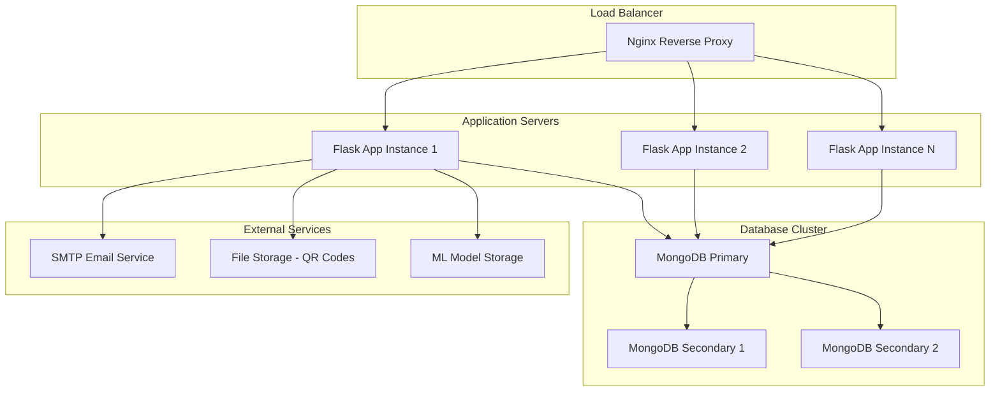

### Configuration Management
**Location**: `config.py`, `.env` files

```python
class ProductionConfig:
    SECRET_KEY = os.getenv('SECRET_KEY')
    MONGO_URI = os.getenv('MONGO_URI')
    MAIL_SERVER = os.getenv('MAIL_SERVER')
    # Security settings
    SESSION_COOKIE_SECURE = True
    SESSION_COOKIE_HTTPONLY = True
    PERMANENT_SESSION_LIFETIME = timedelta(hours=2)
```

This comprehensive design provides a complete technical specification for the SecureTrainer platform, ensuring all challenge types are properly implemented with persistent scoring, ranking systems, and AI-powered adaptive learning capabilities.